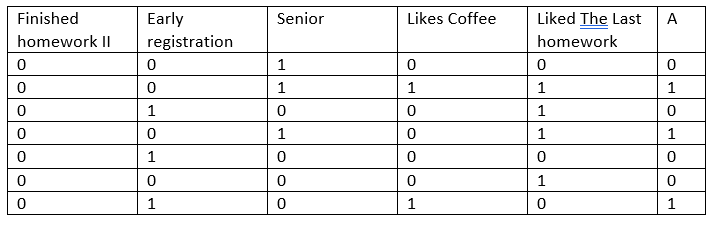

# Problem 1
# Part 1

 

## Entropy for data
* Number of instences=14

* Number of postive(+)=8

* Number of negative(-)=6

* 

##  Early Registration
* Number of ones=6

> 4(+)  And  2(-)

* Number of zeros=8
> 4(+)  And  4(-)

## Finished HomeWork 
* Number of ones=7

> 5(+)  And  2(-)
* Number of zeros=7
> 3(+)  And  4(-)

## Senior
* Number of ones=8
> 5(+)  And  3(-)
* Number of zeros=6
> 3(+)  And  3(-)

## Likes Coffee
* Number of ones=4
> 3(+)  And  1(-)
* Number of zeros=10
> 5(+)  And  5(-)

## Liked The Last homework
* Number of ones=9
> 5(+)  And  4(-)
* Number of zeros=5
> 3(+)  And  2(-)

## `Root Is Finished HomeWork`

# Branch of ONE 

## Entropy for data
* Number of instences=7

* Number of postive(+)=5

* Number of negative(-)=2

##  Early Registration
* Number of ones=3
> 3(+)  And  0(-)
* Number of zeros=4
> 2(+)  And  2(-)

##  Senior
* Number of ones=5
> 3(+)  And  2(-)
* Number of zeros=2
> 2(+)  And  0(-)

##  Likes Coffee
* Number of ones=2
> 1(+)  And  1(-)
* Number of zeros=4
> 4(+)  And  1(-)

## Liked The Last homework
* Number of ones=5
> 3(+)  And  2(-)
* Number of zeros=2
> 2(+)  And  0(-)

## `Second Node in Branch of 1  Is Senior`

# Branch of Zero 

## Entropy for data
* Number of instences=7

* Number of postive(+)=3

* Number of negative(-)=4

##  Early Registration
* Number of ones=3
> 1(+)  And  2(-)
* Number of zeros=4
> 2(+)  And  2(-)

##  Senior
* Number of ones=3
> 2(+)  And  1(-)
* Number of zeros=4
> 1(+)  And  3(-)

##  Likes Coffee
* Number of ones=2
> 2(+)  And  0(-)
* Number of zeros=5
> 1(+)  And  4(-)

## Liked The Last homework
* Number of ones=4
> 2(+)  And  2(-)
* Number of zeros=3
> 1(+)  And  2(-)

## `Second Node in Branch of 0  Is Senior`

# Part 2

* I Think Each Algorithm has advantage and disadvantages 

* C4.5 Cause or construct empty branches or over fitting so it is worse than ID3 to create tree eith less deep

* ID3 Cause Over_fitting or over classified if small sample is tested

* May be CART is better because it can handle numerical and catagorical data , it can identify significant values and eliminate non-significant

> each one of them use different criteria to be created such as ID3 use **``Information Gain``**
and C4.5 use **``Gain Ratio``** and CART use **``Gini Impurity``**

> I think too if we used Random forest concept, may can build many tree with less deep and companine them with some technique to make better decision

